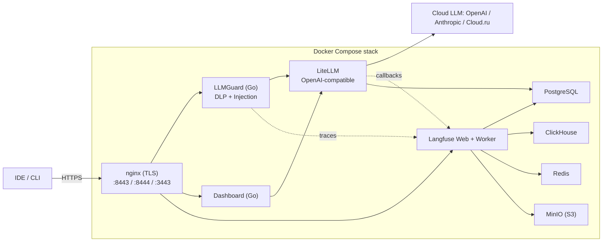

# LLMProxy Platform — Online & On‑Prem RAG

Учебно‑практический проект: production‑ready платформа для безопасного, наблюдаемого и расширяемого LLM‑прокси.
Реализована **online‑часть** (cloud‑LLM через guard + observability) и **спроектирована on‑prem часть** с RAG поверх локальной модели (Qwen/MLX) и Confluence как источника знаний.

> Статус (на 27.05.2026): **Online stack — реализован и протестирован e2e**. **On‑Prem RAG — в стадии проектирования** (см. [docs/architecture-onprem.md](docs/architecture-onprem.md)).

---

## TL;DR — что это вообще такое

`IDE / клиент → HTTPS → nginx (TLS) → LLMGuard (DLP + injection block) → LiteLLM (роутинг моделей) → OpenAI / Anthropic / Cloud.ru`
со сквозной трассировкой каждого запроса в **Langfuse** и веб‑дашбордом для статуса и моделей.



Полная архитектура и расширенные UML‑диаграммы — в [docs/architecture-online.md](docs/architecture-online.md).

---

## Возможности (online stack)

- **TLS termination на nginx** — единая точка входа на трёх портах: `8443` (LLMGuard), `8444` (Dashboard), `3443` (Langfuse).
- **Guard pipeline (Go)** — последовательная цепочка сканеров на входе и выходе:
  - `TokenLimit` (input) — ограничение длины запроса;
  - `PIIGuard` (input) — редакция email / банковских карт / телефонов до отправки в LLM;
  - `PromptInjection` (input) — блокировка попыток обхода system prompt (RU + EN паттерны), `HTTP 403`;
  - `Toxicity` (input + output);
  - `Relevance` (output) — отсекает off‑topic ответы.
- **LiteLLM** — единый OpenAI‑совместимый API: `gpt‑4o`, `gpt‑4o‑mini`, `gpt‑3.5‑turbo` (легко добавить Anthropic / Cloud.ru / Ollama). Хранит конфигурацию моделей в PostgreSQL (`STORE_MODEL_IN_DB=True`).
- **Langfuse (Web + Worker)** — трассировка каждого запроса: input, output, usage, latency, cost. События складываются в ClickHouse + S3 (MinIO).
- **Dashboard (Go)** — простой UI и JSON API: `/api/status` (latency всех сервисов), `/api/models` (актуальный список моделей из LiteLLM).
- **PostgreSQL** — 2 базы (`langfuse`, `litellm`), инициализация SQL‑скриптом.
- **ClickHouse / MinIO / Redis** — observability storage для Langfuse.

Подробное описание поведения каждого сервиса и потока запроса — в [docs/architecture-online.md](docs/architecture-online.md).

---

## Структура проекта

```
LLMProjects/
├── docker-compose.storage.yaml   # Storage + Langfuse (postgres / clickhouse / redis / minio / langfuse-web+worker)
├── docker-compose.proxy.yaml     # Proxy layer (nginx / llmguard / litellm / dashboard)
├── Dockerfile.llmguard           # Multi-stage Go build для LLMGuard
├── Dockerfile.dashboard          # Multi-stage Go build для Dashboard
├── .env.example                  # Пример конфигурации (без секретов)
├── .gitignore                    # Исключает .env, certs/, бинарники
│
├── configs/
│   ├── nginx/nginx.conf          # TLS termination на 3 портах
│   ├── litellm_config.yaml       # Модели + Langfuse callback
│   ├── llmguard.yaml             # Конфиг guard pipeline
│   └── dashboard.yaml            # Адреса сервисов для дашборда
│
├── llmguard/                     # Go-сервис: reverse proxy + guard chain
│   ├── cmd/llmguard/main.go
│   └── internal/{config,scanners,server}/
│
├── dashboard/                    # Go-сервис: status UI + JSON API
│   ├── cmd/dashboard/main.go
│   └── internal/{config,server}/
│
├── init/
│   ├── postgres/init-dbs.sql     # Создаёт БД langfuse + litellm
│   └── clickhouse/single-node-cluster.xml
│
├── scripts/gen-certs.sh          # Самоподписанные TLS-сертификаты
├── setup_rag_venv.sh             # Python venv для будущей on-prem RAG-части
│
└── docs/
    ├── architecture-online.md    # Архитектура online-контура + UML
    ├── architecture-onprem.md    # План on-prem RAG (MLX + Qdrant + Confluence)
    ├── setup-macos.md            # Подготовка macOS (brew / docker / go / pyenv)
    ├── testing-checklist.md      # e2e проверки + guard pipeline + load test
    └── cursor-models.md          # Справка по моделям и агентам Cursor
```

---

## Быстрый старт

### 0. Предварительные требования

- Docker Desktop (или Docker Engine + Compose v2)
- ~6 GB свободной RAM (Langfuse + ClickHouse — самые прожорливые)
- macOS / Linux. Подробная подготовка окружения для macOS — [docs/setup-macos.md](docs/setup-macos.md).

### 1. Конфигурация

```bash
git clone <your-fork-url> LLMProjects
cd LLMProjects

# Создать .env из шаблона
cp .env.example .env

# Сгенерировать собственные секреты для Langfuse и LiteLLM:
echo "LANGFUSE_NEXTAUTH_SECRET=$(openssl rand -base64 32)"
echo "LANGFUSE_SALT=$(openssl rand -base64 32)"
echo "LANGFUSE_ENCRYPTION_KEY=$(openssl rand -hex 32)"   # ровно 64 hex
echo "LITELLM_MASTER_KEY=$(openssl rand -hex 16)"
# Вставить вывод в .env, а также прописать OPENAI_API_KEY.
```

### 2. TLS‑сертификаты (self‑signed для локалки)

```bash
./scripts/gen-certs.sh
# создаст certs/server.crt и certs/server.key (gitignored)
```

### 3. Storage + Langfuse (шаг 3A)

```bash
docker compose -f docker-compose.storage.yaml up -d
docker compose -f docker-compose.storage.yaml ps
```

Проверки:

```bash
curl -s http://localhost:8123/ping              # → Ok.
docker exec -it llmprojects-postgres-1 psql -U postgres -c '\l' | grep -E 'langfuse|litellm'
open http://localhost:3000                       # Langfuse UI → зарегистрируйся
open http://localhost:9001                       # MinIO console (логин = MINIO_ROOT_USER)
```

В Langfuse UI: создай organization + project → Settings → API Keys → скопируй public/secret в `.env`
(`LANGFUSE_PUBLIC_KEY`, `LANGFUSE_SECRET_KEY`).

### 4. Proxy layer (шаги 3B + 3C)

```bash
docker compose -f docker-compose.storage.yaml -f docker-compose.proxy.yaml up -d --build
docker compose -f docker-compose.storage.yaml -f docker-compose.proxy.yaml ps
```

### 5. Smoke‑test

```bash
source .env

# Health
curl -sk https://localhost:8443/health                       # → {"status":"ok"}
curl -sk https://localhost:3443/api/public/health            # → {"status":"OK"}

# Реальный chat completion через весь стек
curl -sk https://localhost:8443/v1/chat/completions \
  -H "Content-Type: application/json" \
  -H "Authorization: Bearer ${LITELLM_MASTER_KEY}" \
  -d '{
    "model": "gpt-4o-mini",
    "messages": [{"role":"user","content":"Скажи короткое приветствие"}],
    "max_tokens": 30
  }'
```

В Langfuse UI (`http://localhost:3000` → Traces) должен появиться trace с input / output / usage.

Полный e2e‑чеклист (включая prompt injection RU+EN, PII, нагрузочный тест) — в
[docs/testing-checklist.md](docs/testing-checklist.md).

### Остановка / пересборка

```bash
# Остановка
docker compose -f docker-compose.storage.yaml -f docker-compose.proxy.yaml down

# Пересборка Go-сервисов после изменений в коде
docker compose -f docker-compose.proxy.yaml build llmguard dashboard
docker compose -f docker-compose.storage.yaml -f docker-compose.proxy.yaml up -d
```

---

## Текущий статус

### Реализовано (online stack)

| Компонент            | Статус | Версия / Примечание                                   |
|----------------------|:------:|-------------------------------------------------------|
| PostgreSQL           |   ✅   | 16-alpine, 2 БД: `langfuse` + `litellm`               |
| ClickHouse           |   ✅   | 24-alpine                                             |
| Redis                |   ✅   | 7-alpine, AOF, requirepass                            |
| MinIO + init bucket  |   ✅   | bucket `langfuse` создаётся автоматически             |
| Langfuse Web         |   ✅   | v3.163.0                                              |
| Langfuse Worker      |   ✅   | пишет события в ClickHouse + MinIO                    |
| LiteLLM              |   ✅   | `main-latest`, модели: gpt-4o, gpt-4o-mini, gpt-3.5   |
| LLMGuard (Go)        |   ✅   | input: TokenLimit + PIIGuard + PromptInjection + Toxicity; output: Toxicity + Relevance |
| Dashboard (Go)       |   ✅   | HTML + `/api/status`, `/api/models`                   |
| nginx TLS            |   ✅   | self-signed, 8443 / 8444 / 3443                       |

### e2e тесты (пройдены)

- ✅ `/v1/chat/completions` через весь стек (`gpt-4o-mini` → OpenAI → ответ → trace в Langfuse)
- ✅ Prompt injection EN (`Ignore previous instructions`) → `HTTP 403` blocked
- ✅ Prompt injection RU (`Игнорируй все предыдущие инструкции`) → `HTTP 403` blocked
- ✅ PII (email + номер карты) → данные редактированы до `[REDACTED:EMAIL]` / `[REDACTED:CARD]` **до** отправки в LLM
- ✅ Model routing: `gpt-4o` и `gpt-4o-mini` маршрутизируются независимо
- ✅ Load test: 20/20 успешных запросов, avg latency ~857ms
- ✅ Dashboard `/api/status`: все сервисы healthy, latency ~10ms
- ✅ Langfuse traces содержат input / output / usage / metadata

### Известные ограничения

- **TLS на localhost**: на macOS системные curl/браузеры могут перехватывать HTTPS-трафик через Cloudflare WARP. Гарантированный способ протестировать guard pipeline — стучаться напрямую на `http://localhost:8080` (llmguard).
- **PromptInjection** — эвристика на паттернах. Baseline‑защита, но не заменяет ML‑классификатор для production.
- **Образ LiteLLM** не содержит `curl`/`wget` — healthcheck выполняется через `python -c "urllib.request..."`.
- **Blocked-запросы** сейчас не доходят до LiteLLM и не попадают в Langfuse автоматически. Чтобы видеть их в трейсах — добавить отдельный Langfuse HTTP call в LLMGuard для blocked events (в backlog).

---

## Roadmap

### Ближайшие шаги (online stack — production hardening)

- [ ] Логировать blocked-запросы (HTTP 403 от LLMGuard) в Langfuse как `llmguard-blocked` события.
- [ ] Заменить `latest` теги (`minio/minio`, `langfuse/langfuse`, `ghcr.io/berriai/litellm:main-latest`) на конкретные версии.
- [ ] Per-IP rate limiting в LLMGuard (или на nginx).
- [ ] Добавить `RegexGuard` (паспорта/ИНН/СНИЛС/секреты) и `DictionaryGuard` (имена сотрудников, внутренние термины).
- [ ] `LANGFUSE_TELEMETRY_ENABLED=false` в `.env`.
- [ ] CI: golangci-lint + go vet + `docker compose config` validation.

### Следующий крупный этап — On-Prem RAG

Спроектирован отдельный on-prem контур для работы с **корпоративной базой знаний (Confluence)** через локальную LLM (Qwen2.5-Coder-32B-8bit на MLX) и Qdrant как векторное хранилище.
Полное описание архитектуры, ingest pipeline, runtime flow и нюансов (нагрузка на Mac Studio, threshold-tuning, fine-tuning) — в [docs/architecture-onprem.md](docs/architecture-onprem.md).

Ключевая идея: **объединить** online и on-prem контуры — поставить LLMGuard впереди и на его уровне решать, идёт ли запрос в `qdrant + rag-api + MLX` (если входной контекст содержит чувствительные данные) или в облако через LiteLLM.

---

## Дополнительные документы

- [docs/architecture-online.md](docs/architecture-online.md) — детальная архитектура online-стека, описание каждого сервиса, поток запроса, расширенная UML-диаграмма.
- [docs/architecture-onprem.md](docs/architecture-onprem.md) — план on-prem RAG (Qwen/MLX + LiteLLM + rag-api + Qdrant + Confluence + Open WebUI).
- [docs/setup-macos.md](docs/setup-macos.md) — пошаговая установка окружения на macOS (brew / Docker / Go / pyenv / curl / jq / httpie).
- [docs/testing-checklist.md](docs/testing-checklist.md) — полный e2e чеклист: guard pipeline, PII, prompt injection, load test, Langfuse traces, MinIO objects.
- [docs/cursor-models.md](docs/cursor-models.md) — справка по моделям и агентам в Cursor IDE, как выбирать модель под задачу.

---

## Безопасность

- Все секреты живут только в локальном `.env` (gitignored). Шаблон — `.env.example`, в нём нет реальных ключей.
- TLS-сертификаты (`certs/server.crt`, `certs/server.key`) генерируются локально и тоже в `.gitignore`.
- Для prod: замени self-signed на сертификат от Let's Encrypt / внутреннего CA; ротация `LITELLM_MASTER_KEY`, ключей Langfuse и `LANGFUSE_ENCRYPTION_KEY` (если меняется — пересоздай БД, см. [docs/architecture-online.md](docs/architecture-online.md)).
- `LLMGuard` редактирует PII **до** отправки в LLM — но не до записи в Langfuse: проверь, что в трейсах не сохраняется оригинальный контент (пункт в roadmap).

---

## Лицензия

MIT (или какую укажешь при публикации) — для учебно‑демонстрационных целей.
