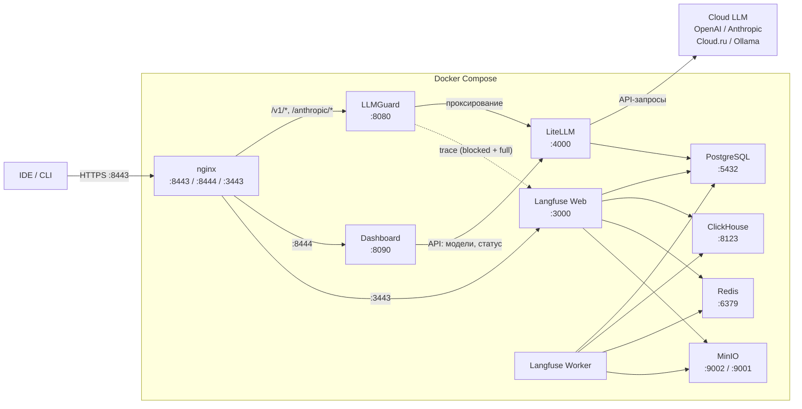
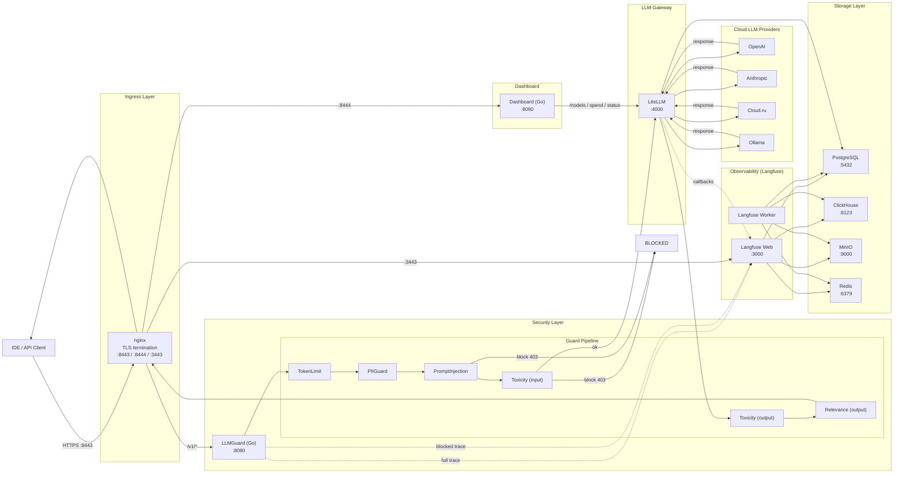

# Архитектура online-контура (LLM-proxy)

> Это **реализованная** часть стека: nginx → LLMGuard → LiteLLM → Cloud LLM, со сквозной трассировкой через Langfuse и Dashboard для статуса.

## Описание сервисов

**Nginx** — единая точка входа для всех внешних подключений. Выполняет TLS-терминацию на трёх портах: `8443` (LLMGuard), `8444` (Dashboard), `3443` (Langfuse). Все внутренние сервисы работают по plain HTTP, шифрование обеспечивается только на уровне nginx. Конфигурация хранится в `configs/nginx/nginx.conf`.

**LLMGuard** — Go reverse-proxy, стоящий между nginx и LiteLLM. Реализует DLP guard pipeline: последовательно проверяет каждый запрос через `TokenLimit`, `PIIGuard`, `PromptInjection`, `Toxicity` (на input) и `Toxicity`, `Relevance` (на output). Перехватывает ответы LLM-провайдеров и (в roadmap) будет отправлять полные трейсы напрямую в Langfuse как `llmguard-blocked` для заблокированных запросов.

**LiteLLM** — AI Gateway с единым OpenAI-совместимым API для 100+ моделей. Управляет маршрутизацией запросов к провайдерам (OpenAI, Anthropic, Cloud.ru, Ollama). Поддерживает виртуальные ключи и группы доступа к моделям. Хранит конфигурацию моделей в PostgreSQL (`STORE_MODEL_IN_DB=True`), что позволяет управлять ими через UI и API. Предоставляет веб-интерфейс администрирования на `/ui/`.

**Dashboard** — Go веб-панель для мониторинга. Показывает usage / spend по пользователям, список моделей, статус сервисов с latency. Динамически забирает данные из LiteLLM API.

**Langfuse (Web + Worker)** — платформа observability для LLM-запросов. Web-сервис предоставляет UI для просмотра трейсов, аналитики стоимости и анализа промптов. Worker асинхронно обрабатывает входящие события и записывает их в ClickHouse и S3 (MinIO). Обе компоненты разделяют одну конфигурацию и подключаются к общим хранилищам. Доступен извне через nginx на порту `3443` (HTTPS).

**PostgreSQL** — основная реляционная СУБД, обслуживает две базы: `langfuse` (пользователи, проекты, ключи, метаданные трейсов) и `litellm` (конфигурация моделей, виртуальные ключи, cost tracking). Инициализируется скриптом `init/postgres/init-dbs.sql`. Данные персистентны через Docker volume `postgres_data`.

**ClickHouse** — колоночная СУБД для аналитических запросов Langfuse. Хранит детальные данные трейсов и событий для быстрой агрегации. Используется для построения дашбордов и аналитики. Поддерживает миграции через `CLICKHOUSE_MIGRATION_URL`. Volume: `clickhouse_data`.

**MinIO** — S3-совместимое объектное хранилище, используемое Langfuse для медиа и событий. Префиксы: `events/` и `media/`. Bucket `langfuse` создаётся init-контейнером `minio-init`. Консоль на порту `9001`. Volume: `minio_data`.

**Redis** — in-memory очередь и кеш для Langfuse. Настроен с `--appendonly yes` и защищён паролем (`--requirepass`). Используется обоими компонентами Langfuse (web и worker) для координации обработки событий. Volume: `redis_data`.

---

## Guard Pipeline

| Сканер              | Где            | Что делает                                                                                                  | Действие |
|---------------------|----------------|-------------------------------------------------------------------------------------------------------------|----------|
| `TokenLimit`        | input          | Проверка длины запроса (по умолчанию 4096 токенов)                                                          | Block    |
| `PIIGuard`          | input          | ПДн: email, банковские карты (Luhn), телефоны, ФИО, ИНН/СНИЛС/паспорт                                       | Redact   |
| `PromptInjection`   | input          | Prompt injection, jailbreak, попытки утечки system prompt (RU + EN паттерны, threshold 0.85)                | Block    |
| `Toxicity` (input)  | input          | Токсичный пользовательский запрос                                                                           | Block    |
| `Toxicity` (output) | output         | Токсичный ответ модели                                                                                      | Block    |
| `Relevance`         | output         | Отсекает off-topic / нерелевантные ответы (threshold 0.1)                                                   | Block    |

**Roadmap-сканеры** (см. ветку «backlog» в README): `RegexGuard` (секреты — пароли, API-ключи, IP), `DictionaryGuard` (словари — имена сотрудников, внутренние термины).

---

## Поток запроса (online)

1. IDE/клиент отправляет HTTPS-запрос на `:8443` (nginx).
2. nginx терминирует TLS и проксирует в LLMGuard (`:8080`, plain HTTP внутри docker-сети).
3. LLMGuard извлекает текст последнего user-сообщения.
4. Текст последовательно проходит через цепочку input-сканеров.
5. Если `PromptInjection` или `Toxicity` сработал — запрос блокируется (`HTTP 403`).
6. Если `PIIGuard` сработал — чувствительные данные заменяются на `[REDACTED:EMAIL]` / `[REDACTED:CARD]` / `[REDACTED:PHONE]` **до** отправки в LLM.
7. Запрос проксируется в LiteLLM (`:4000`).
8. LiteLLM маршрутизирует запрос к нужному провайдеру (OpenAI / Anthropic / GLM / Ollama).
9. Ответ возвращается через LiteLLM в LLMGuard.
10. LLMGuard прогоняет ответ через output-сканеры (Toxicity, Relevance) и при необходимости блокирует.
11. LiteLLM callback (`success_callback: ["langfuse"]`) отправляет полный trace в Langfuse: input + output + usage + cost + latency + metadata.
12. Ответ возвращается клиенту через nginx.

---

## Конфигурационные файлы

| Файл                                | Описание                                                                  |
|-------------------------------------|---------------------------------------------------------------------------|
| `configs/litellm_config.yaml`       | Список моделей, master_key (из env), Langfuse callback                    |
| `configs/llmguard.yaml`             | Адрес upstream, настройки guard pipeline, threshold-ы                     |
| `configs/dashboard.yaml`            | Адреса сервисов для проверки latency                                      |
| `configs/nginx/nginx.conf`          | TLS-терминация nginx на 8443 / 8444 / 3443                                |
| `.env`                              | Все секреты: API-ключи, БД, Langfuse keys, master key (gitignored)        |
| `docker-compose.storage.yaml`       | Storage + observability layer (6 сервисов)                                |
| `docker-compose.proxy.yaml`         | Proxy layer (nginx + llmguard + litellm + dashboard, 4 сервиса)           |

---

## Mermaid: общая схема

---

## Mermaid: расширенная UML-диаграмма

---

## Нюансы реализации (на которые наступили)

1. **Образ LiteLLM не содержит `wget`/`curl`** — healthcheck через `python -c "urllib.request.urlopen(...)"`.
2. **Сеть `backend`** во втором compose-файле объявлена как `external: true, name: llmprojects_backend` — она поднимается storage-стеком, а proxy-стек к ней присоединяется.
3. **`litellm_config.yaml`** использует синтаксис `os.environ/VAR_NAME` — это **официальный** способ LiteLLM ссылаться на env-переменные, не Jinja-шаблон.
4. **Langfuse Next.js** по умолчанию слушает на `eth0` — пришлось установить `HOSTNAME="0.0.0.0"` в env, иначе healthcheck на `127.0.0.1:3000` не отвечает.
5. **Langfuse healthcheck по IPv6** ломается — пришлось явно использовать `wget -qO- http://127.0.0.1:3000/api/public/health | grep -qi ok`.
6. **`LANGFUSE_S3_EVENT_UPLOAD_BUCKET` + аналогичные media-переменные** обязательны — без них worker не стартует.
7. **macOS + Cloudflare WARP** перехватывает HTTPS на localhost. Поэтому guard-тесты надёжнее делать на `http://localhost:8080` напрямую (минуя nginx).
