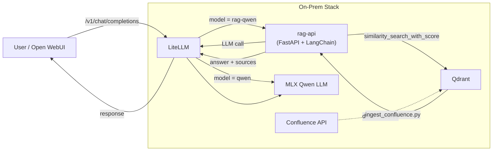
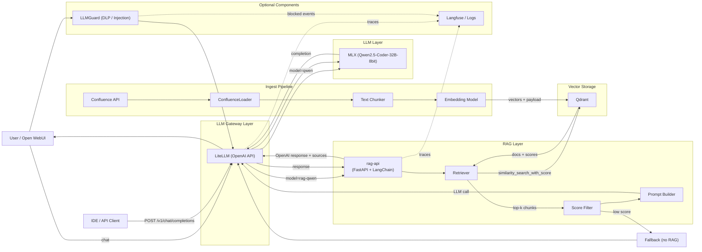

# On-Prem RAG контур (план)

> Это **проектная часть**: расширение текущего online-стека локальной LLM (Qwen2.5-Coder-32B-8bit на MLX), векторным хранилищем (Qdrant) и RAG-слоем поверх корпоративной базы знаний (Confluence).
>
> В этом документе зафиксирована архитектура, ingest pipeline, runtime flow, отличия от online-варианта и ключевые нюансы из практики (нагрузка на Mac Studio, threshold tuning, fine-tuning).

---

## Зачем это нужно

Online-стек хорошо работает для общих задач, но **не подходит для работы с внутренними знаниями компании**:

- Облачные модели не знают наш Confluence, наши runbooks, наши API.
- Отправлять конфиденциальный контекст в OpenAI — нельзя.
- Нужна возможность задать вопрос «как сделать X в нашем проекте Y» — и получить ответ с цитатой из внутреннего документа.

Решение — RAG (Retrieval-Augmented Generation) поверх локальной LLM:
1. Индексируем Confluence → embeddings → Qdrant.
2. На запрос ищем top-k релевантных чанков.
3. Если контекст найден — формируем prompt и зовём локальную LLM.
4. Возвращаем ответ + список источников.

---

## Стек

| Компонент      | Роль                                                                                            |
|----------------|-------------------------------------------------------------------------------------------------|
| **MLX**        | Локальный inference: модель `Qwen2.5-Coder-32B-Instruct-8bit`, запускается через MLX runtime    |
| **LiteLLM**    | OpenAI-совместимый шлюз: маршрутизация `rag-qwen` → rag-api, `qwen2.5` → напрямую в MLX         |
| **rag-api**    | FastAPI + LangChain. Реализует `POST /v1/chat/completions` с retrieval + prompt injection       |
| **Qdrant**     | Векторное хранилище. Коллекция `confluence_docs`, similarity search                             |
| **Confluence** | Источник знаний (страницы, документы) → ingest через `ConfluenceLoader`                         |
| **Open WebUI** | Удобный чат-интерфейс, ходит в LiteLLM как в обычный OpenAI API                                 |

---

## Архитектура



### Расширенная UML-диаграмма



---

## Ingest pipeline (подготовка данных)

Скрипт `ingest_confluence.py`:

1. **Подключение к Confluence** — API token, выбор space / page.
2. **Загрузка документов** — HTML → markdown.
3. **Чанкинг** — размер 500–1000 токенов, overlap 10–20%.
4. **Генерация embeddings** — через локальную (или внешнюю) модель.
5. **Запись в Qdrant** — `vector` + `payload`:
   - `text`
   - `source` (URL страницы)
   - `page_id`
   - `space`, `title`, `updated_at`

---

## Runtime flow (запрос → ответ)

1. **Клиент** отправляет `POST /v1/chat/completions` с `model = rag-qwen`.
2. **LiteLLM** маршрутизирует в `rag-api` (`api_base: http://rag-api:8000`).
3. **rag-api**:
   1. *Lazy init* — подключается к Qdrant и LiteLLM при первом запросе.
   2. *Retrieval* — `similarity_search_with_score(query, k)` → top-k чанков из `confluence_docs`.
   3. *Score gate*:
      - Если `top_score > threshold` (например, 0.5) — используем RAG.
      - Иначе — fallback на обычный chat completion без контекста.
   4. *Prompt builder* — собирает финальный prompt:
      ```
      system: <role>
      context:
        [#1 source=...] <chunk text>
        [#2 source=...] <chunk text>
      user: <original question>
      ```
   5. *LLM call* — вызов `qwen2.5-coder-32b` через LiteLLM (которая идёт в MLX).
   6. Возвращает OpenAI-совместимый JSON со `choices[0].message.content` и (опционально) блоком источников.
4. **Стриминг** — поддерживается, чанки прокидываются через rag-api → LiteLLM → клиент.

---

## Структура проекта (on-prem часть)

```
on-prem/
├── docker-compose.yml             # qdrant + litellm + rag-api + open-webui
├── rag_api.py                     # OpenAI-compatible endpoint
├── ingest_confluence.py           # Загрузка Confluence → Qdrant
├── litellm-config.yaml            # Маршрутизация моделей
├── Dockerfile.rag-api
├── requirements-rag-api.txt
└── DEPLOY_PLAN.md
```

`litellm-config.yaml` (фрагмент):

```yaml
model_list:
  - model_name: rag-qwen
    litellm_params:
      api_base: http://rag-api:8000
      api_key: not-used

  - model_name: qwen2.5
    litellm_params:
      model: openai/qwen2.5-coder-32b-instruct-8bit
      api_base: http://host.docker.internal:8082  # MLX server
```

---

## Запуск

```bash
# 1. Поднять стек
docker compose up -d

# 2. Индексация Confluence (один раз, потом по расписанию)
python ingest_confluence.py \
  --confluence-url https://wiki.company.com \
  --space ENG \
  --collection confluence_docs

# 3. Health-check rag-api
curl http://localhost:8000/healthz

# 4. Тест
curl http://localhost:8000/v1/chat/completions \
  -H "Content-Type: application/json" \
  -d '{
    "model": "rag-qwen",
    "messages": [{"role":"user","content":"Как у нас настраивается X?"}]
  }'
```

---

## Отличия от Online Proxy

| Компонент       | Online            | On-Prem RAG                      |
|-----------------|-------------------|----------------------------------|
| LLM             | Cloud (OpenAI/…)  | MLX (Qwen2.5-Coder-32B-8bit)     |
| Guard           | LLMGuard          | (опционально, тот же LLMGuard)   |
| Observability   | Langfuse          | можно подключить тот же Langfuse |
| Knowledge       | —                 | Confluence                       |
| Retrieval       | —                 | Qdrant + embeddings              |
| UI              | IDE / API         | + Open WebUI для чат-режима      |

---

## Нюансы и грабли (из практики)

### 1. Mac Studio как inference-машина

Если запускать на **Mac Studio M2 Ultra 96 GB** (~500к₽):

- ~22 GB сразу съедает система (macOS + UI).
- В режиме **Claude Code agent / Cursor agent** на каждый запрос прикрепляется конфигуратор на ~22 500 токенов — это +3 минуты только на префилл, **до** начала реальной генерации.
- При использовании напрямую через **Open WebUI** этого overhead'а нет: запрос содержит только реальный контекст → задержки нормальные.

**Сравнение скорости** (грубо):

| Машина                                    | Скорость генерации |
|-------------------------------------------|--------------------|
| Mac Studio M2 Ultra 96 GB (MLX, Qwen 32B) | ~2k tokens / sec   |
| Сервер с RTX 4090 / H100 (vLLM, Qwen 32B) | ~500k–1M tokens / sec на batch |

Разница в **~500×** на throughput — но для индивидуальных интерактивных запросов Mac Studio даёт приемлемые ~30–60 t/s генерации.

### 2. Объединение online + on-prem контуров

Идеальная архитектура: **LLMGuard впереди обоих контуров**, и на его уровне делать `if`:

```
if input_contains_sensitive_context(request):
    route to on-prem (rag-qwen / qwen2.5)
else:
    route to online (gpt-4o / claude-sonnet)
```

Это даёт:
- Конфиденциальные запросы остаются внутри периметра.
- Общие запросы идут в облако за лучшее качество.
- Единая точка observability (Langfuse) для обоих маршрутов.

### 3. Tuning retrieval (важная часть!)

Качество ответа = качество retrieval. Параметры, которые надо подбирать:

- **chunk_size**: 500–1000 токенов. Меньше → точнее, но теряется контекст. Больше → шумнее.
- **chunk_overlap**: 10–20%. Защищает от потери информации на границах.
- **k (top-k)**: 3–7 чанков. Больше → больше контекста, но и больше шума + дороже prompt.
- **score_threshold**: 0.4–0.7 (cosine similarity). Ниже — fallback без RAG.
- **embedding модель**: `BAAI/bge-m3` или `intfloat/multilingual-e5-large` — обе хороши для русского.

Без подбора threshold rag-api будет либо **галлюцинировать** (всегда тянет шумные чанки), либо **молчать** (всегда уходит в fallback).

### 4. Fine-tuning

База Qwen2.5-Coder хороша для кода, но **не знает доменной терминологии компании**. Для production-качества:

1. Собрать датасет Q&A из Confluence + Slack истории.
2. LoRA fine-tuning поверх Qwen2.5-Coder-32B.
3. Конвертация в MLX-совместимый формат.

Это не блокер для MVP, но даёт +20–30% к качеству ответов на узкоспециальных вопросах.

---

## Roadmap для on-prem контура

- [ ] Базовый PoC: `ingest_confluence.py` + `rag_api.py` + `docker-compose.yml`.
- [ ] Подключить LLMGuard как front для обоих контуров (online + on-prem).
- [ ] Включить Langfuse traces для rag-api (`trace.start_span()` для retrieval, embedding, LLM call).
- [ ] Подобрать threshold / chunk_size на реальных данных.
- [ ] Open WebUI как пользовательский UI.
- [ ] Инкрементальный реиндекс Confluence (только изменённые страницы).
- [ ] LoRA fine-tuning Qwen под доменную лексику.
- [ ] Бенчмарки качества: RAGAS / TruLens.
